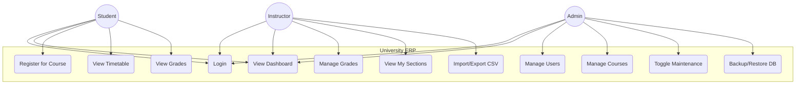
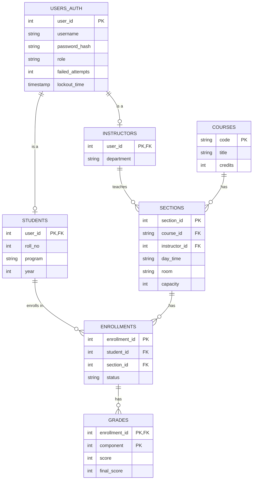
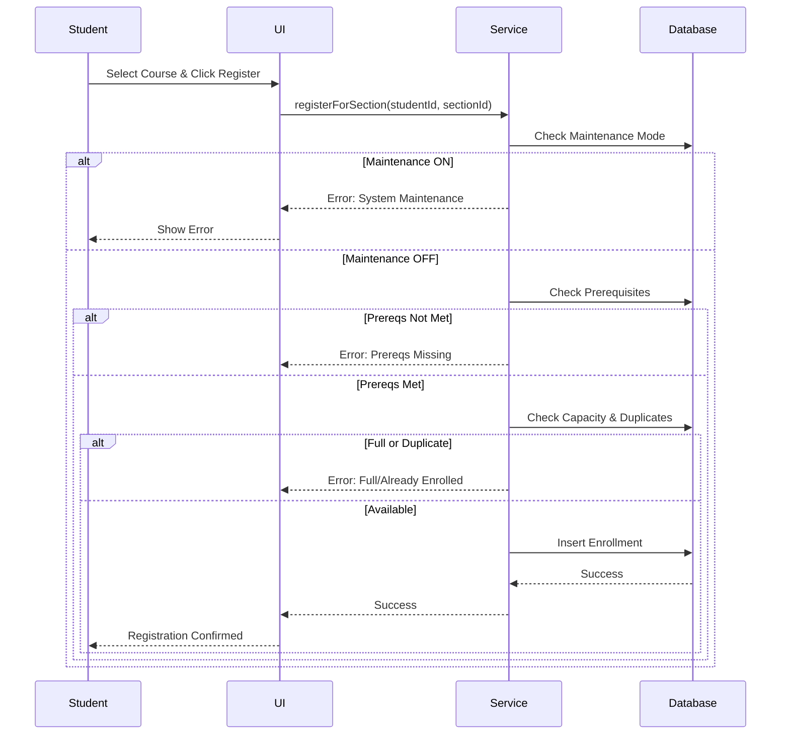

# System Diagrams

## 1. Use Case Diagram

```mermaid
graph TD
    Student((Student))
    Instructor((Instructor))
    Admin((Admin))

    subgraph "University ERP"
        UC1(Login)
        UC2(View Dashboard)
        UC3(Register for Course)
        UC4(View Timetable)
        UC5(View Grades)
        UC6(Manage Grades)
        UC7(View My Sections)
        UC8(Import/Export CSV)
        UC9(Manage Users)
        UC10(Manage Courses)
        UC11(Toggle Maintenance)
        UC12(Backup/Restore DB)
    end

    Student --> UC1
    Student --> UC2
    Student --> UC3
    Student --> UC4
    Student --> UC5

    Instructor --> UC1
    Instructor --> UC2
    Instructor --> UC6
    Instructor --> UC7
    Instructor --> UC8

    Admin --> UC1
    Admin --> UC2
    Admin --> UC9
    Admin --> UC10
    Admin --> UC11
    Admin --> UC12
```

## 2. Entity-Relationship Diagram (ERD)

```mermaid
erDiagram
    USERS_AUTH {
        int user_id PK
        string username
        string password_hash
        string role
        int failed_attempts
        timestamp lockout_time
    }
    
    STUDENTS {
        int user_id PK, FK
        int roll_no
        string program
        int year
    }
    
    INSTRUCTORS {
        int user_id PK, FK
        string department
    }
    
    COURSES {
        string code PK
        string title
        int credits
    }
    
    SECTIONS {
        int section_id PK
        string course_id FK
        int instructor_id FK
        string day_time
        string room
        int capacity
    }
    
    ENROLLMENTS {
        int enrollment_id PK
        int student_id FK
        int section_id FK
        string status
    }
    
    GRADES {
        int enrollment_id PK, FK
        int component PK
        int score
        int final_score
    }

    USERS_AUTH ||--o| STUDENTS : "is a"
    USERS_AUTH ||--o| INSTRUCTORS : "is a"
    INSTRUCTORS ||--o{ SECTIONS : "teaches"
    COURSES ||--o{ SECTIONS : "has"
    STUDENTS ||--o{ ENROLLMENTS : "enrolls in"
    SECTIONS ||--o{ ENROLLMENTS : "has"
    ENROLLMENTS ||--o{ GRADES : "has"
```

## 3. Workflow: Course Registration

```mermaid
sequenceDiagram
    participant Student
    participant UI
    participant Service
    participant Database

    Student->>UI: Select Course & Click Register
    UI->>Service: registerForSection(studentId, sectionId)
    Service->>Database: Check Maintenance Mode
    alt Maintenance ON
        Service-->>UI: Error: System Maintenance
        UI-->>Student: Show Error
    else Maintenance OFF
        Service->>Database: Check Prerequisites
        alt Prereqs Not Met
            Service-->>UI: Error: Prereqs Missing
        else Prereqs Met
            Service->>Database: Check Capacity & Duplicates
            alt Full or Duplicate
                Service-->>UI: Error: Full/Already Enrolled
            else Available
                Service->>Database: Insert Enrollment
                Database-->>Service: Success
                Service-->>UI: Success
                UI-->>Student: Registration Confirmed
            end
        end
    end
```
